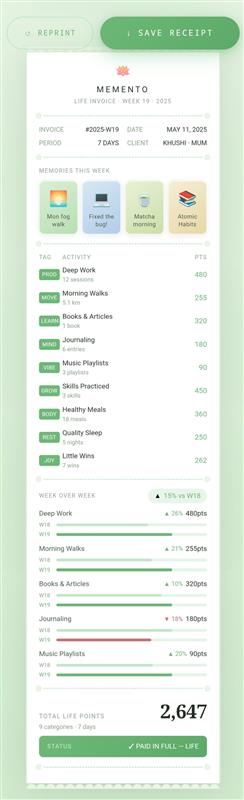

# 🧠 Memento – Life Invoice Generator

Memento is a web-based life tracking application built with Next.js that transforms your weekly activities, habits, and memories into a meaningful “life invoice”.

It helps users reflect on how they spend their time and how they improve week by week.

---

## 🚀 Features

✅ Weekly activity tracking  
✅ Compare current week with previous week  
✅ Life invoice generation (summary of your time)  
✅ Upload images for weekly memories 📸  
✅ Screen time & habit tracking (manual input)  
✅ Personal progress insights  

---

## 💡 Concept

> “Your life is made of moments. Memento helps you measure and reflect on them.”

Memento acts like a **digital life journal + tracker**:
- Records your weekly activities
- Stores memory images
- Shows improvement over time

---

## 📊 Example Output
# 🧠 Memento – Life Invoice Generator

Memento is a web-based life tracking application built with Next.js that transforms your weekly activities, habits, and memories into a meaningful “life invoice”.

It helps users reflect on how they spend their time and how they improve week by week.

---

## 🚀 Features

✅ Weekly activity tracking  
✅ Compare current week with previous week  
✅ Life invoice generation (summary of your time)  
✅ Upload images for weekly memories 📸  
✅ Screen time & habit tracking (manual input)  
✅ Personal progress insights  

---

## 💡 Concept

> “Your life is made of moments. Memento helps you measure and reflect on them.”

Memento acts like a **digital life journal + tracker**:
- Records your weekly activities
- Stores memory images
- Shows improvement over time

---

## 📊 Example Output
# 🧠 Memento – Life Invoice Generator

Memento is a web-based life tracking application built with Next.js that transforms your weekly activities, habits, and memories into a meaningful “life invoice”.

It helps users reflect on how they spend their time and how they improve week by week.

---

## 🚀 Features

✅ Weekly activity tracking  
✅ Compare current week with previous week  
✅ Life invoice generation (summary of your time)  
✅ Upload images for weekly memories 📸  
✅ Screen time & habit tracking (manual input)  
✅ Personal progress insights  

---

## 💡 Concept

> “Your life is made of moments. Memento helps you measure and reflect on them.”

Memento acts like a **digital life journal + tracker**:
- Records your weekly activities
- Stores memory images
- Shows improvement over time

---

## 📊 Example Output
